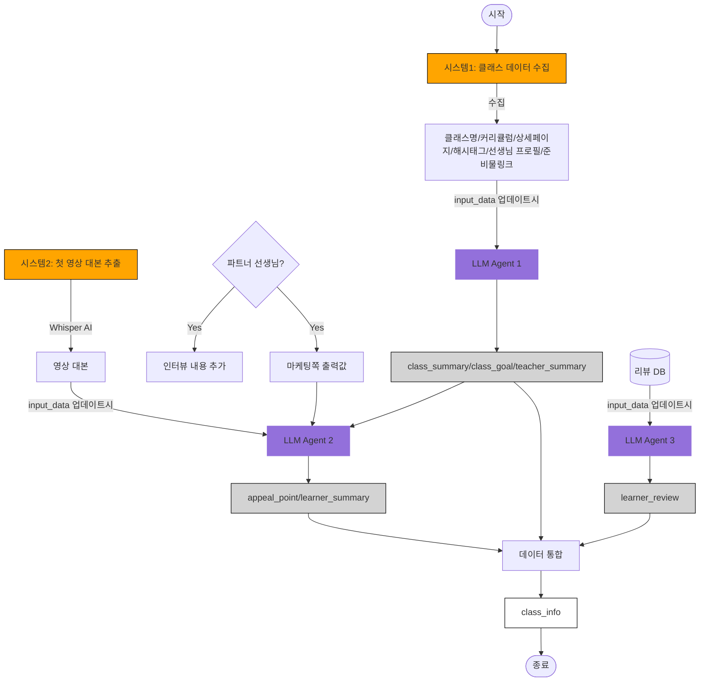

## input 값 정리
1. LLM agent1 input_data
    - 클래스명 / 커리큘럼 / 상세페이지 / 해시태그 / 선생님 프로필
2. LLM agent2 input_data
    - LLM 에이전트 1 출력값(class_summary/class_goal/teacher_summary) + 영상 대본
    - (파트너의 경우) 인터뷰 내용 / 마케팅 출력값 추가 
3. LLM agent3 input_data
    - 리뷰 DB

## 업데이트 이벤트 (트리거)
- input_data 업데이트 시 에이전트 실행
- LLM 에이전트3의 경우, 리뷰 데이터 업데이를 기준으로 갈지, 주기로 갈지 고민지점임.

