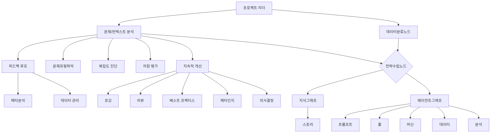
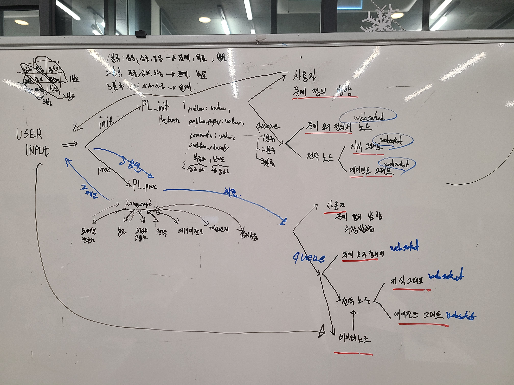

# AGI 프로세스 프레임워크

## 1. 문제해결 접근 방식의 본질

### 1.1 현재 LLM 활용의 한계점
- LLM의 '만능 해결사 신드롬' 현상
- 문제의 본질에 대한 깊이 있는 이해 부족
- 획일적인 문제 해결 접근법의 위험성

### 1.2 5단계 본질 추적 프레임워크
- Why 1: 효율성 추구 → AI를 통한 즉각적 해결 갈망
- Why 2: 복잡성 회피 → 깊이 있는 이해 없는 해결 추구
- Why 3: 구조화 부재 → 체계적 문제 분류 시스템 미흡
- Why 4: 메타인지 부족 → 문제해결 과정에 대한 고차원적 이해 부재
- Why 5: 프레임워크 부재 → 체계적 사고 구조 미확립

**핵심 결론: 문제의 특성과 복잡도에 따른 차별화된 접근이 필요하며, 이를 위한 체계적인 데이터 수집과 분석이 선행되어야 함**

## 2. AGI 문제해결 프로세스

### 멀티에이전틱 프로세스
### AI 컴포저 프로세스
### 에이전틱 평가-디벨롭 프로세스

### 2.1 기본 프로세스 프레임워크
1. 문제 인식 및 분석
   - 문제 유형 분류
   - 복잡도 평가
   - 필요 리소스 산정
   
2. 전략 수립
   - LLM 활용 전략 결정
   - 단계별 실행 계획
   - 성공 지표 정의

3. 실행 및 검증
   - 프롬프트 엔지니어링
   - 검증 포인트 설정
   - 피드백 시스템 구축

4. 메타 분석
   - 해결 과정 효과성 평가
   - 인사이트 도출
   - 프로세스 개선점 식별

### 2.2 고도화된 실행 체계

#### 문제 분류 시스템
- 복잡도-도메인 매트릭스 구축
- 최적 LLM 전략 매핑
- 사례 데이터베이스 구축

#### 프롬프트 엔지니어링 체계
- 문제 유형별 템플릿
- 품질 관리 기준
- 체크리스트 시스템

#### 지속적 개선 메커니즘
- 프로세스 로깅
- 정기 리뷰 시스템
- 베스트 프랙티스 공유

## 3. 실행 아키텍처

### 3.1 노드 구조


### 3.2 특화 에이전트
- 성과 측정/평가 에이전트
- 메타인지 보조 에이전트
- 패턴분석 에이전트
- 실험설계 에이전트

## 4. 구현 계획

### 4.1 에이전트 노드 구축
1. 기본 프롬프트 기반 노드
   - 프로젝트 리더
   - 전략 수립
   - 도메인 전문가
   - 지식/에이전트 그래프

2. 통합 노드
   - 툴 연동
   - 머신 러닝 결합
   - API 연동

### 4.2 프로젝트 리더 노드 스키마
```json
{
    "problem_definition": {
        "context": {
            "background": "string", // 배경
            "current_situation": "string", // 현재 상황
            "pain_points": ["string"] // 문제점
        },
        "objectives": {
            "primary_goal": "string", // 주요 목표
            "sub_goals": ["string"], // 보조 목표
            "success_criteria": ["string"] // 성공 기준
        },
        "resources": {
            "available_data": ["string"], // 가용 데이터
            "constraints": ["string"], // 제약 사항
            "requirements": ["string"] // 요구 사항
        },
        "problem_classification": {
            "domain": ["string"], // 도메인
            "complexity": "string", // 복잡도
            "difficulty": "string", // 난이도
            "project_type": "string" // 프로젝트 유형
        }
    },
    "update_type": "strategic", // 전략적 업데이트 여부
    "additional_information": ["string"], // 추가로 추론된 정보들 : 이건 프로젝트 리더가 추정한 사항을 넣어주세요. 
    "problem_include": boolean, // 문제 포함 여부  true & false
    "objective_include": boolean, // 목표 포함 여부  true & false
    "resource_include": boolean // 자원 포함 여부  true & false   
}
```

### 4.3 신뢰도 평가 시스템
복잡도-난이도 조합에 따른 분류:

1. 혁신 프로젝트 (상상, 상중, 중상)
   - 새로운 가치 창출
   - 시장/산업 혁신
   - 복합 시스템 구축

2. 발전 프로젝트 (상하, 중중, 하상)
   - 기존 가치 향상
   - 서비스/프로세스 개선
   - 현재 솔루션 발전

3. 집중 프로젝트 (하하, 중하, 하중)
   - 구체적 목표 달성
   - 명확한 솔루션 구현
   - 즉각적 변화 창출

## 정보 수집 프로토콜

### 프로젝트 유형별 필요 정보
1. 혁신 프로젝트: 문제 + 목표 + 자원
2. 발전 프로젝트: 문제 + 목표
3. 집중 프로젝트: 문제

위 정보 수집 여부에 따라 전략 노드에게 갈지 혹은 대화를 지속할지 초기 프로젝트 시작할때는 선택됩니다. 

**프로젝트 진행중에는 다양한 컨셉을 잡아나가며, 유저가 선택한 경우에만 전략 노드로 넘어갑니다.**

