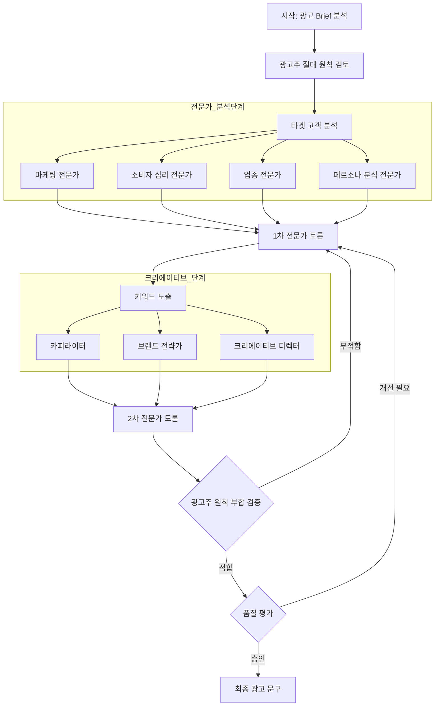

# AGI 솔루션  - AGI 기반 지능형 문제해결 플랫폼

## 1. 제품 소개
### 제품명: AGI (AGI Solution)
- "AGI" 가제 
- AI 기반 지식 연결 및 문제해결을 위한 AGI 솔루션

## 2. 핵심 가치
### 비전
- 전문가의 지식과 AI를 결합한 혁신적인 문제해결 플랫폼
- 각 전문 도메인 영역을 풀어 내는 문제해결 솔루션
- 글로벌 도메인 전문가들의 지식을 연결하는 AI 기반 지식 공유 생태계
- AGI 기반 사회적 혁신 가속화

### 차별화 포인트
- LLM 성능 최적화를 위한 데이터와 ML 통계모델 활용
- AI와 인간의 유기적 협업을 통한 지능형 워크플로우
- 멀티에이전트를 통한 AGI 솔루션
- 에이전틱 시스템 구축
- ai 컴포저 프레임워크(코딩 없이도 AI 기반 솔루션을 구성할 수 있는 직관적인 도구)
- 에이전틱 평가-디벨롭 프레임워크

## 3. 핵심 구성 요소
### 서비스 개요
- 사용자 중심의 프로젝트 기반 워크플로우 시스템
- LLM과의 대화형 인터페이스를 통한 멀티에이전트 설계 및 구현
- 데이터 수집, 가공, 분석을 위한 통합 툴 체인
- ML/통계 모델 기반의 의사결정 지원 시스템
- 에이전트-툴 연동을 통한 자동화된 문제해결
- 커스텀 데이터셋 구축 및 활용 시스템
- 외부 API 연동 및 리소스 공유 플랫폼

### 핵심 기능
1. 프로젝트 관리
   - 워크플로우 기반 프로젝트 생성 및 관리
   - 멀티에이전트 설계 및 구현
   - 에이전트-툴 연동 관리

2. 에이전트 시스템
   - LLM 기반 대화형 에이전트 생성
   - 목적별 특화 에이전트 구현
   - 멀티에이전트 워크플로우 설계

3. 데이터 처리
   - 다양한 형식의 원본 데이터 처리 (Excel, PDF, Text, Image)
   - 구조화된 데이터 모델 변환 (JSON)
   - 커스텀 데이터셋 구축 및 관리

4. 의사결정 지원
   - ML/통계 모델 기반 분석
   - 데이터 기반 인사이트 도출
   - 최적화된 문제해결 방안 제시

## 4. 주요 기능

### 프로젝트 관리
- 목적 기반 프로젝트 생성
- 참여자 및 리소스 관리
- API 통합 관리

### 데이터 및 지식 관리
- Raw 데이터 처리 및 관리
- 지식 그래프 생성 및 연동
- 도메인별 지식베이스 구축

### AI Process
- LLM 프로젝트 설계
- 데이터 전처리 및 모델 통합
- 에이전트 설정 및 워크플로우 실행
- 고급 ML 모델 통합:
  - 지도학습 모델
  - 통계 기반 ML 모델
  - 하이브리드 접근방식

### 협업 플랫폼
- 리소스 공유 시스템
- 전문가 지식 교류
- 커뮤니티 기반 협업

## 5. 문제해결 메커니즘

### 지능형 노드 시스템
- 도메인 특화 모델 통합
- 데이터 기반 의사결정
- ML 모델 앙상블

### 최적화 프로세스
- 모듈화된 문제해결 접근
- 병렬 처리 최적화
- 지속적 학습 및 개선

## 6. 활용 사례
- 비즈니스 프로세스 자동화
- 데이터 기반 의사결정
- 협업적 문제해결
- 과학적 모델링/시뮬레이션
- 금융 리스크 분석
- 의료 진단 지원

## 7. 개발 로드맵
### 단기 목표
- 베타 테스트 진행
- 사용자 피드백 수집
- 기본 기능 안정화

### 장기 목표
- 산업별 특화 모델 개발
- API 생태계 확장
- 자동화 기능 고도화
- 도메인별 노드 라이브러리 확장

## 결론
AGI는 AI, 머신러닝, 인간 전문성의 시너지를 통해 복잡한 문제를 해결하고 AGI 기반 혁신을 가속화합니다. 글로벌 전문가들의 집단 지성과 AI의 능력을 결합하여 새로운 차원의 문제해결 플랫폼을 제시합니다.

## 프로젝트 예시: 광고 Brief 분석 프로세스

