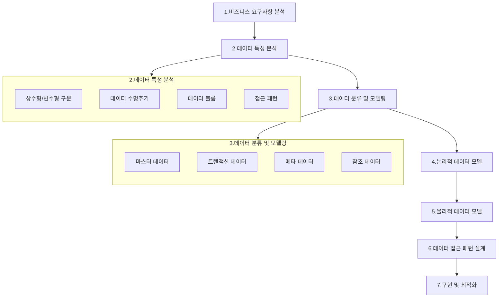

# 데이터 아키텍처

## 1. 비즈니스 요구사항 분석 (확장)

- 비즈니스 목표 및 KPI 정의
- 주요 비즈니스 프로세스 파악
- 데이터 거버넌스 요구사항 확인
- 규제 및 컴플라이언스 요구사항 파악

## 2. 데이터 특성 분석 (귀하가 언급하신 첫 번째 단계)

- 상수형/변수형 구분
- 데이터 수명주기 분석
- 데이터 볼륨 예측
- 데이터 품질 요구사항 정의

## 3. 데이터 분류 및 모델링 (귀하가 언급하신 두 번째 단계)

- 마스터 데이터 식별
- 트랜잭션 데이터 식별
- 메타데이터 정의
- 참조 데이터 식별

## 4. 논리적 데이터 모델 설계

- 엔티티 관계 정의
- 정규화 수준 결정
- 비즈니스 룰 반영
- 데이터 품질 규칙 정의

## 5. 물리적 데이터 모델 설계

- 스토리지 아키텍처 설계
- 파티셔닝/샤딩 전략
- 인덱싱 전략
- 성능 최적화 방안

## 6. 데이터 접근 패턴 설계 (귀하가 언급하신 인터페이스/추상화)

- API 설계
- 데이터 접근 계층 정의
- 캐싱 전략
- 보안 �� 접근 제어

## 7. 구현 및 최적화

- 성능 모니터링 방안
- 확장성 계획
- 장애 복구 전략
- 지속적인 최적화 계획

### 주요 고려사항:

- 비즈니스 요구사항과 기술적 구현 사이의 균형
- 확장성과 유지보수성
- 데이터 품질과 정합성
- 성능과 비용
- 보안과 규정 준수

### 이런 체계적인 접근을 통해:

- 비즈니스 요구사항을 충실히 반영
- 미래의 변화에 유연하게 대응
- 안정적이고 확장 가능한 아키텍처 구현
- 효율적인 유지보수와 운영이 가능

