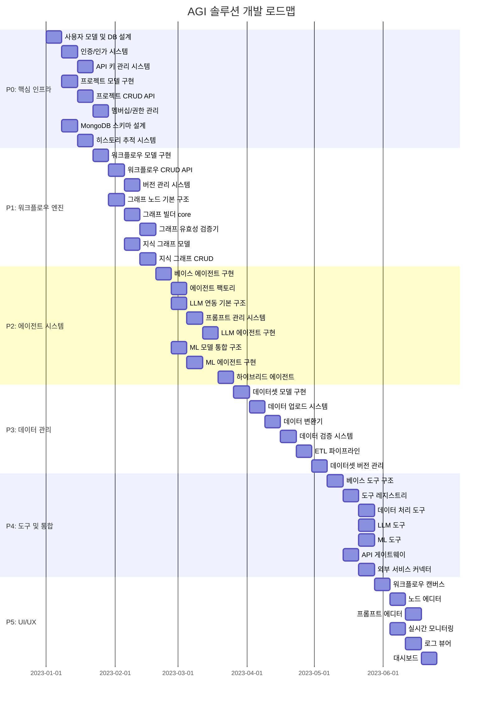

# AGI 솔루션 개발 스케줄

## 개발 단위 및 퀀트 차트

## 개발팀 구성 및 역할

### Backend 핵심 개발자 (2명)

#### 개발자 A: 인프라 및 코어 시스템
- 담당 영역:
  - 사용자/인증 시스템
  - 프로젝트 관리
  - 워크플로우 엔진
- 주요 태스크:
  - P0_1 ~ P0_6
  - P1_1 ~ P1_3

#### 개발자 B: 에이전트 및 그래프 시스템
- 담당 영역:
  - 에이전트 프레임워크
  - 그래프 시스템
  - 도구 시스템
- 주요 태스크:
  - P1_4 ~ P1_8
  - P4_1 ~ P4_2

### AI/ML 개발자 (2명)

#### 개발자 C: LLM 시스템
- 담당 영역:
  - LLM 통합
  - 프롬프트 관리
  - LLM 에이전트
- 주요 태스크:
  - P2_3 ~ P2_5
  - P4_4

#### 개발자 D: ML 시스템
- 담당 영역:
  - ML 모델 통합
  - ML 에이전트
  - 데이터 파이프라인
- 주요 태스크:
  - P2_6 ~ P2_7
  - P4_5

### 데이터 엔지니어 (1명)

#### 개발자 E: 데이터 관리
- 담당 영역:
  - 데이터셋 관리
  - ETL 파이프라인
  - 데이터 검증
- 주요 태스크:
  - P3_1 ~ P3_6
  - P4_3

### Frontend 개발자 (2명)

#### 개발자 F: UI 컴포넌트
- 담당 영역:
  - 워크플로우 디자이너
  - 노드 에디터
  - 프롬프트 에디터
- 주요 태스크:
  - P5_1 ~ P5_3

#### 개발자 G: 모니터링 UI
- 담당 영역:
  - 대시보드
  - 모니터링 시스템
  - 로그 뷰어
- 주요 태스크:
  - P5_4 ~ P5_6

### DevOps 엔지니어 (1명)

#### 개발자 H: 인프라 및 배포
- 담당 영역:
  - CI/CD 파이프라인
  - 모니터링 시스템
  - 성능 최적화
- 주요 태스크:
  - P0_7 ~ P0_8
  - P4_6 ~ P4_7

## 개발 프로세스

### 스프린트 관리
- 1주일 단위의 스프린트로 진행
- 매주 월요일 스프린트 계획 미팅
- 매주 금요일 스프린트 리뷰 및 회고

### 협업 규칙
1. 모든 코드는 PR을 통해 리뷰 후 머지
2. 주요 기능은 테스트 코드 필수
3. 문서화는 개발과 동시에 진행
4. 일일 스탠드업 미팅으로 진행 상황 공유

### 품질 관리
1. 코드 리뷰 필수
2. 테스트 커버리지 80% 이상 유지
3. 성능 모니터링 지표 설정
4. 보안 검토 프로세스 준수

### 릴리즈 계획
- Alpha: P0, P1 완료 후
- Beta: P2 완료 후
- RC: P3 완료 후
- v1.0: P4, P5 완료 후
