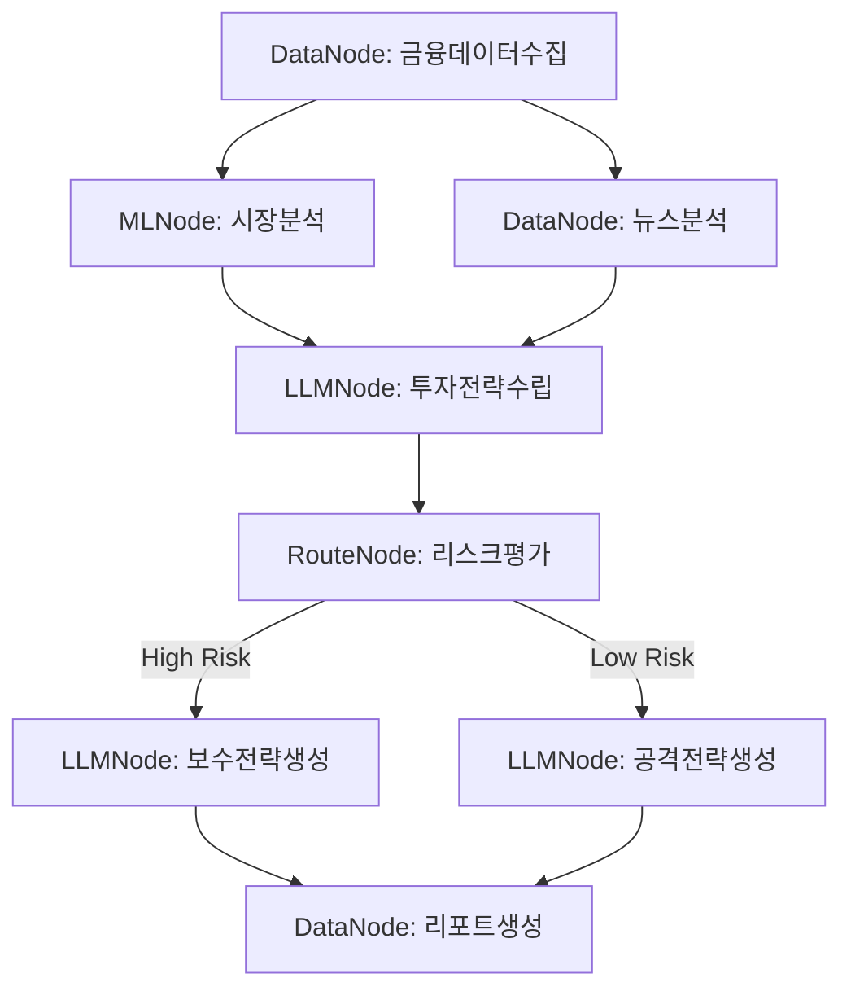
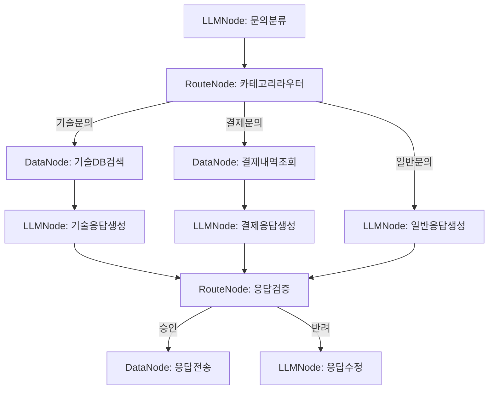
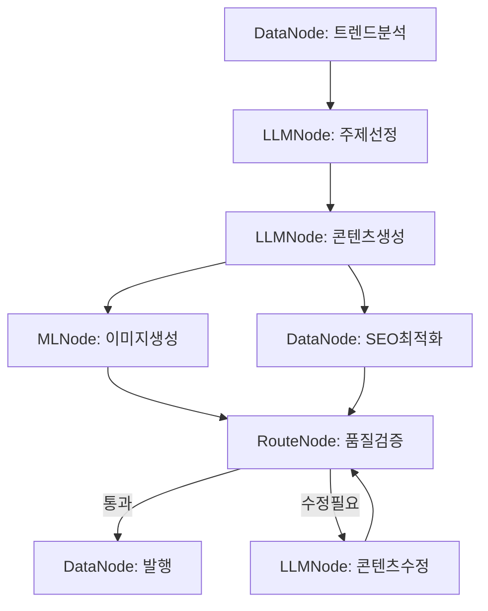

# 그래프 시나리오 예시

이 문서는 AGI 솔루션의 그래프 시스템을 활용한 실제 시나리오 예시를 제공합니다.

## 1. 데이터 기반 투자 분석 워크플로우

이 시나리오는 금융 데이터를 분석하고 투자 추천을 생성하는 워크플로우입니다.



### 주요 노드 설명
1. **금융데이터수집 (DataNode)**
   - 실시간 주가 데이터
   - 거래량 정보
   - 기업 재무제표

2. **시장분석 (MLNode)**
   - 기술적 지표 계산
   - 트렌드 분석
   - 패턴 인식

3. **투자전략수립 (LLMNode)**
   - 데이터 기반 투자 전략 생성
   - 리스크 요소 식별
   - 포트폴리오 구성 제안

## 2. 고객 서비스 자동화 워크플로우

이 시나리오는 고객 문의를 자동으로 처리하고 적절한 응답을 생성하는 워크플로우입니다.



### 주요 노드 설명
1. **문의분류 (LLMNode)**
   - 문의 내용 분석
   - 카테고리 분류
   - 우선순위 할당

2. **카테고리라우터 (RouteNode)**
   - 문의 유형별 라우팅
   - 처리 우선순위 적용
   - 로드 밸런싱

3. **응답생성 (LLMNode)**
   - 맥락 기반 응답 생성
   - 톤/스타일 조정
   - 다국어 지원

## 3. 콘텐츠 제작 자동화 워크플로우

이 시나리오는 마케팅 콘텐츠를 자동으로 생성하고 최적화하는 워크플로우입니다.



### 주요 노드 설명
1. **트렌드분석 (DataNode)**
   - 소셜미디어 트렌드 수집
   - 검색 키워드 분석
   - 경쟁사 콘텐츠 분석

2. **콘텐츠생성 (LLMNode)**
   - 타겟 맞춤형 콘텐츠 작성
   - 멀티포맷 지원
   - 브랜드 톤앤매너 적용

3. **품질검증 (RouteNode)**
   - 품질 기준 체크
   - 브랜드 가이드라인 준수 확인
   - 법적/윤리적 검증

### 구현 예시

```python
from project.workflow.agent_graph.graphs.builder import GraphBuilder, NodeType

def create_content_workflow():
    builder = GraphBuilder()

    # 노드 추가
    builder.add_node("trend_analysis", NodeType.DATA, {
        "data_sources": ["social_media", "search_trends"],
        "analysis_type": "trend"
    })

    builder.add_node("topic_selection", NodeType.LLM, {
        "model": "gpt-4",
        "temperature": 0.7
    })

    builder.add_node("content_generation", NodeType.LLM, {
        "model": "gpt-4",
        "max_tokens": 2000
    })

    # 노드 연결
    builder.connect("trend_analysis", "topic_selection")
    builder.connect("topic_selection", "content_generation")

    return builder
```

각 시나리오는 실제 비즈니스 요구사항을 반영하며, 노드 간의 논리적 흐름과 데이터 의존성을 고려하여 설계되었습니다. 이러한 워크플로우는 StateManager를 통해 각 노드의 실행 상태와 데이터를 추적하고 관리합니다.
