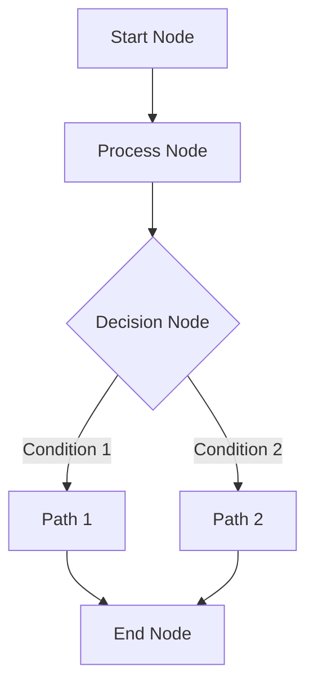

# Graph Analysis and Design

## Purpose
워크플로우 그래프 개발 시작 전, 요구사항 분석 및 설계 방향 결정

## Process

1. Requirements Analysis
   - 해결하고자 하는 문제가 무엇인가?
   - 필요한 데이터 처리 단계는 무엇인가?
   - 어떤 종류의 결정이나 분기가 필요한가?

2. Node Identification
   A. Required Node Types
      - LLM Nodes
        * 어떤 자연어 처리가 필요한가?
        * 어떤 프롬프트들이 필요한가?

      - Data Nodes
        * 어떤 데이터를 조회/저장해야 하는가?
        * 데이터 필터링/변환이 필요한가?

      - ML Nodes
        * 어떤 머신러닝 추론이 필요한가?
        * 모델의 입/출력은 무엇인가?

      - Router Nodes
        * 어떤 조건부 분기가 필요한가?
        * 병렬 처리가 필요한가?

   B. Node Dependencies
      - 노드 간 데이터 흐름은 어떻게 되는가?
      - 어떤 노드들이 병렬 실행 가능한가?
      - 어떤 노드들이 동기적 실행이 필요한가?

3. Edge Design
   - 노드 간 연결 관계 정의
   - 데이터 흐름 경로 설계
   - 조건부 분기 경로 설계

4. Execution Planning
   - 실행 순서 결정
   - 병렬 실행 가능 구간 식별
   - 에러 처리 전략 수립

## Output

### 1. Node List
```python
nodes = [
    {
        "name": str,          # 노드 고유 식별자
        "type": NodeType,     # 노드 타입
        "type_id": str,       # 구체적 구현 타입
        "description": str,   # 노드 설명
        "config": dict,       # 노드 설정
        "execution": {
            "mode": str,      # 실행 모드
            "requires": list  # 의존성
        }
    }
]
```

### 2. Edge List
```python
edges = [
    {
        "id": str,        # 엣지 고유 식별자
        "source": str,    # 시작 노드 이름
        "target": str     # 도착 노드 이름
    }
]
```

### 3. Workflow Diagram


### 4. Implementation Notes
- [ ] 필요한 프롬프트 템플릿
- [ ] 데이터셋 요구사항
- [ ] 에러 처리 전략
- [ ] 성능 고려사항

## Example Analysis

### Problem Statement
"사과를 어디서 살 수 있는지 알려주세요."

### Node Analysis
1. LLM Nodes
   - 요청 이해 노드 (understand_request)
   - 응답 생성 노드 (generate_response)

2. Data Nodes
   - 가게 정보 조회 노드 (fetch_store_data)

3. Router Nodes
   - 가격대별 분기 노드 (optional)

### Edge Analysis
1. understand_request → fetch_store_data
2. fetch_store_data → generate_response

### Implementation Considerations
- 프롬프트 최적화
- 데이터 필터링 전략
- 응답 품질 보장

## Node and Edge Types Reference

### Node Types

1. **LLM Node**
   ```python
   {
       "type": "llm",
       "type_id": str,  # 사용할 LLM 모델
       "config": {
           "prompt_id": str,           # 프롬프트 템플릿 ID
           "variables": Dict[str, str]  # 변수 매핑
       }
   }
   ```
   - 용도: 자연어 처리, 텍스트 생성, 분석
   - 예시 type_id: "gpt-4", "claude-2"

2. **Data Node**
   ```python
   {
       "type": "data",
       "type_id": str,  # 데이터셋 타입
       "config": {
           "dataset_id": str,          # DATASETS 테이블 ID
           "data_type": str,           # RAW or MODEL
           "filters": Dict[str, Any],  # 선택적 필터
           "columns": List[str]        # 선택적 컬럼
       }
   }
   ```
   - 용도: 데이터 접근, 저장, 조회
   - 예시 type_id: "qa_dataset", "store_dataset"

3. **ML Node**
   ```python
   {
       "type": "ml",
       "type_id": str,  # ML 모델 타입
       "config": {
           "model_id": str,            # 모델 ID
           "input_columns": List[str],  # 입력 특성
           "output_column": str         # 출력 컬럼
       }
   }
   ```
   - 용도: 머신러닝 모델 추론
   - 예시 type_id: "classifier", "regressor"

4. **Router Node**
   ```python
   {
       "type": "router",
       "type_id": str,  # 라우터 타입
       "config": {
           "next_nodes": List[str],     # 가능한 다음 노드들
           "conditions": Dict[str, str], # 조건별 매핑
           "default_node": str          # 기본 노드
       }
   }
   ```
   - 용도: 조건부 분기, 병렬 처리
   - 예시 type_id: "condition", "multi_condition"

### Common Node Properties
```python
{
    "name": str,          # 고유 식별자
    "description": str,   # 설명
    "execution": {
        "mode": str,      # "sync" or "async"
        "timeout": int,   # 제한 시간 (초)
        "requires": List[str]  # 의존하는 노드들
    }
}
```

### Edge Properties
```python
{
    "id": str,     # 고유 식별자
    "source": str, # 시작 노드 name
    "target": str  # 도착 노드 name
}
```

### Variable Reference Patterns
- 노드 출력 참조: `"node_name.output_field"`
- 입력 데이터 참조: `"input.field_name"`
- 이전 노드 참조: `"previous.field_name"`

### Execution Modes
1. **Synchronous (sync)**
   - 순차적 실행이 필요한 경우
   - 이전 노드의 결과가 즉시 필요한 경우

2. **Asynchronous (async)**
   - 독립적으로 실행 가능한 경우
   - 병렬 처리가 가능한 경우

### Dependencies Management
1. **Explicit Dependencies**
   - `requires` 필드로 명시적 의존성 정의
   - 실행 순서 보장

2. **Implicit Dependencies**
   - 변수 참조를 통한 자동 의존성
   - 데이터 흐름 기반 실행 순서

## Node and Edge Requirements

### Node Requirements

1. **Uniqueness**
   - 각 노드의 `name`은 워크플로우 내에서 고유해야 함
   - 동일한 `name`을 가진 노드가 있으면 안 됨

2. **Completeness**
   - 모든 필수 필드가 채워져 있어야 함
   - 타입별 필수 설정이 모두 제공되어야 함

3. **Validity**
   - `type`은 정의된 NodeType 중 하나여야 함
   - `type_id`는 해당 타입에서 지원하는 값이어야 함
   - `execution.mode`는 "sync" 또는 "async"여야 함

4. **Dependencies**
   - `requires`에 명시된 모든 노드가 존재해야 함
   - 순환 의존성이 없어야 함

### Edge Requirements

1. **Uniqueness**
   - 각 엣지의 `id`는 워크플로우 내에서 고유해야 함
   - 동일한 `source`와 `target`을 가진 중복 엣지는 불가

2. **Node References**
   - `source`와 `target`은 실제 존재하는 노드의 name이어야 함
   - 존재하지 않는 노드를 참조할 수 없음

3. **Direction**
   - 모든 엣지는 방향성을 가짐
   - 순환 참조는 허용되지 않음

### Node-Edge Relationship Requirements

1. **Connectivity**
   ```python
   # 유효한 연결
   {
       "nodes": [
           {"name": "node1", "type": "llm", ...},
           {"name": "node2", "type": "data", ...}
       ],
       "edges": [
           {"id": "edge1", "source": "node1", "target": "node2"}
       ]
   }
   ```

2. **Router Node Connections**
   - Router 노드의 `next_nodes`에 명시된 모든 노드는 edge로 연결되어야 함
   ```python
   {
       "nodes": [
           {
               "name": "router1",
               "type": "router",
               "config": {
                   "next_nodes": ["node2", "node3"]
               }
           }
       ],
       "edges": [
           {"source": "router1", "target": "node2"},
           {"source": "router1", "target": "node3"}
       ]
   }
   ```

3. **Execution Dependencies**
   - 노드의 `requires`에 명시된 노드들과의 연결성 보장
   ```python
   {
       "nodes": [
           {
               "name": "node3",
               "execution": {
                   "requires": ["node1", "node2"]
               }
           }
       ],
       "edges": [
           {"source": "node1", "target": "node3"},
           {"source": "node2", "target": "node3"}
       ]
   }
   ```

4. **Variable References**
   - 노드가 참조하는 변수의 출처 노드와 연결되어야 함
   ```python
   {
       "nodes": [
           {
               "name": "llm_node",
               "config": {
                   "variables": {
                       "context": "data_node.output"
                   }
               }
           }
       ],
       "edges": [
           {"source": "data_node", "target": "llm_node"}
       ]
   }
   ```

### Validation Rules

1. **Node Validation**
   ```python
   def validate_nodes(nodes: List[Dict]):
       names = set()
       for node in nodes:
           if node["name"] in names:
               raise ValueError(f"Duplicate node name: {node['name']}")
           names.add(node["name"])
   ```

2. **Edge Validation**
   ```python
   def validate_edges(edges: List[Dict], nodes: List[Dict]):
       node_names = {node["name"] for node in nodes}
       edge_ids = set()
       for edge in edges:
           if edge["id"] in edge_ids:
               raise ValueError(f"Duplicate edge id: {edge['id']}")
           if edge["source"] not in node_names:
               raise ValueError(f"Invalid source node: {edge['source']}")
           if edge["target"] not in node_names:
               raise ValueError(f"Invalid target node: {edge['target']}")
           edge_ids.add(edge["id"])
   ```

3. **Dependency Validation**
   ```python
   def validate_dependencies(nodes: List[Dict], edges: List[Dict]):
       for node in nodes:
           if "requires" in node.get("execution", {}):
               for required in node["execution"]["requires"]:
                   if not any(e["source"] == required and e["target"] == node["name"]
                            for e in edges):
                       raise ValueError(
                           f"Missing edge for required dependency: {required} -> {node['name']}"
                       )
   ```
