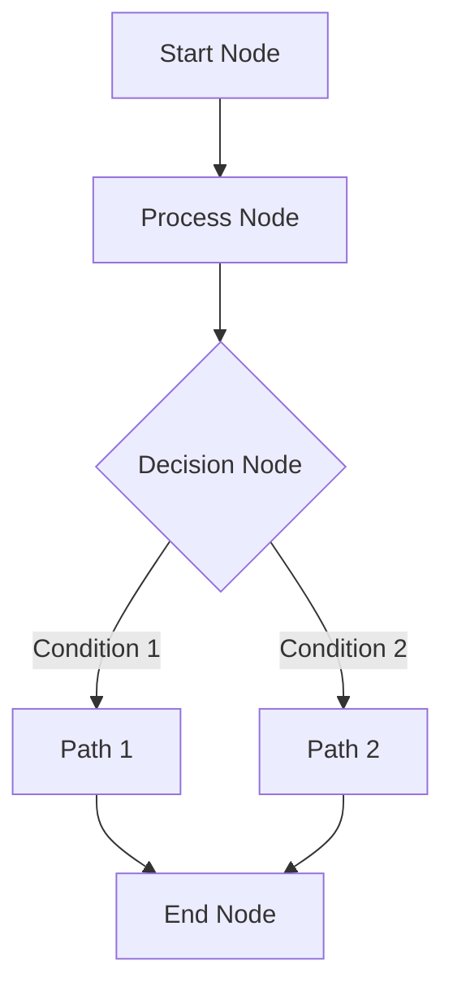

# Graph Design

## Purpose
워크플로우 그래프 개발을 위한 전반적인 설계 방향 결정

## Process

1. Requirements Analysis
   - 해결하고자 하는 문제가 무엇인가?
   - 필요한 데이터 처리 단계는 무엇인가?
   - 어떤 종류의 결정이나 분기가 필요한가?

2. Edge Design
   - 노드 간 연결 관계 정의
   - 데이터 흐름 경로 설계
   - 조건부 분기 경로 설계

3. Execution Planning
   - 실행 순서 결정
   - 병렬 실행 가능 구간 식별
   - 에러 처리 전략 수립

## Output

### 1. Workflow Structure
```python
workflow = {
    "nodes": List[Node],
    "edges": List[Edge],
    "config": Dict[str, Any]
}
```

### 2. Workflow Diagram


### 3. Implementation Notes
- [ ] 필요한 프롬프트 템플릿
- [ ] 데이터셋 요구사항
- [ ] 에러 처리 전략
- [ ] 성능 고려사항

## Example Analysis

### Problem Statement
"사과를 어디서 살 수 있는지 알려주세요."

### Graph Analysis
1. 필요한 노드 식별
   - 요청 이해 노드 (understand_request)
   - 가게 정보 조회 노드 (fetch_store_data)
   - 응답 생성 노드 (generate_response)

2. 엣지 분석
   - understand_request → fetch_store_data
   - fetch_store_data → generate_response

### Implementation Considerations
- 프롬프트 최적화
- 데이터 필터링 전략
- 응답 품질 보장

## Graph Requirements

### Validation Rules

1. **Graph Validation**
```python
def validate_graph(nodes: List[Dict], edges: List[Dict]):
    validate_nodes(nodes)
    validate_edges(edges, nodes)
    validate_dependencies(nodes, edges)
```

2. **Connectivity Validation**
```python
def validate_connectivity(nodes: List[Dict], edges: List[Dict]):
    # 모든 노드가 적절히 연결되어 있는지 확인
    for node in nodes:
        if not any(e["source"] == node["name"] or e["target"] == node["name"]
                  for e in edges):
            raise ValueError(f"Isolated node found: {node['name']}")
```

3. **Cycle Detection**
```python
def detect_cycles(nodes: List[Dict], edges: List[Dict]):
    # 순환 참조 검사
    graph = defaultdict(list)
    for edge in edges:
        graph[edge["source"]].append(edge["target"])

    visited = set()
    path = set()

    def dfs(node):
        if node in path:
            return True
        if node in visited:
            return False

        path.add(node)
        visited.add(node)

        for next_node in graph[node]:
            if dfs(next_node):
                return True

        path.remove(node)
        return False

    for node in nodes:
        if dfs(node["name"]):
            raise ValueError("Cycle detected in graph")
```
