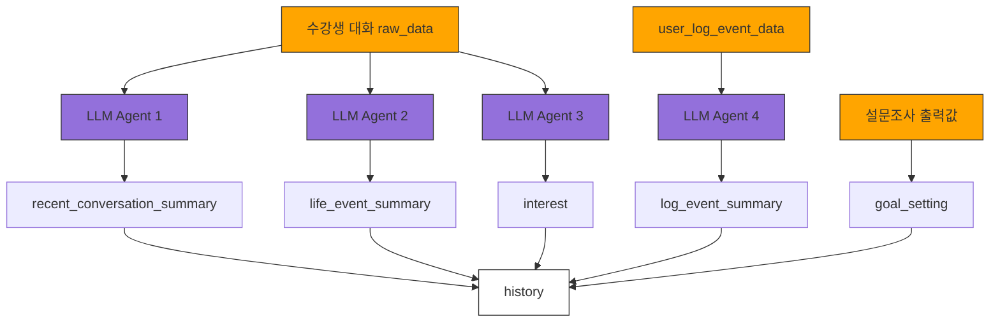

## input 값 정리
1. LLM agent1, 2, 3 input_data
    - 수강생 대화 raw_data
2. LLM agent4 input_data
    - user_log_event_data 

## 업데이트 이벤트 (트리거)
- agent 1, 2, 3
    - raw_data가 10,000토큰 쌓였을 경우.
- agent 4 update
    - 다른 프롬프트에서 history 참조 필요 시, update 진행.