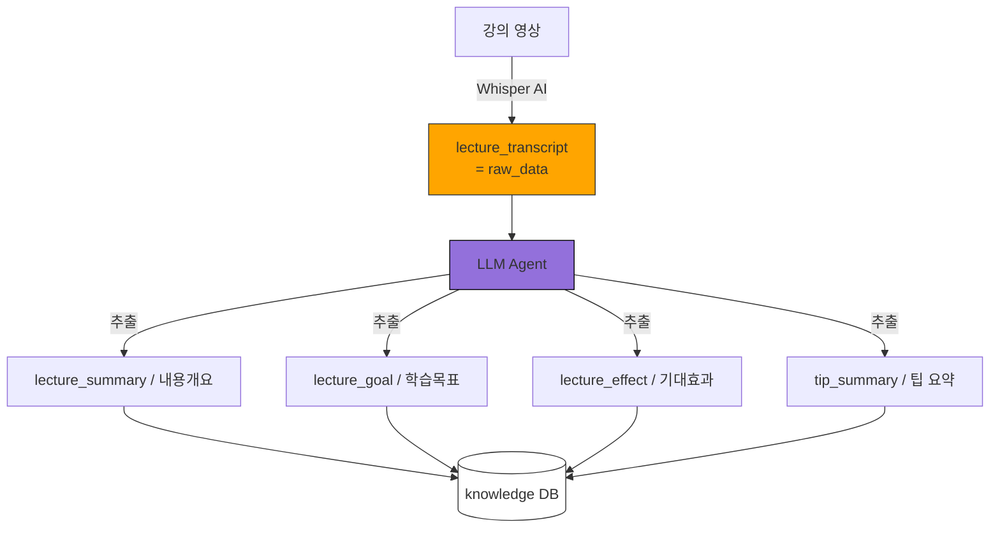

## input 값 정리
1. LLM agent input_data
    - 각 강의영상 별 lecture_transcript

## 업데이트 이벤트
- 새로운 강의가 추가되었을 시

## knowledge DB 구성
- class_id
- class_name
- lecture_id
- lecture_title
- mission
- lecutre_materials
- lecture_summary
- lecture_goal
- lecture_effect
- tip_summary