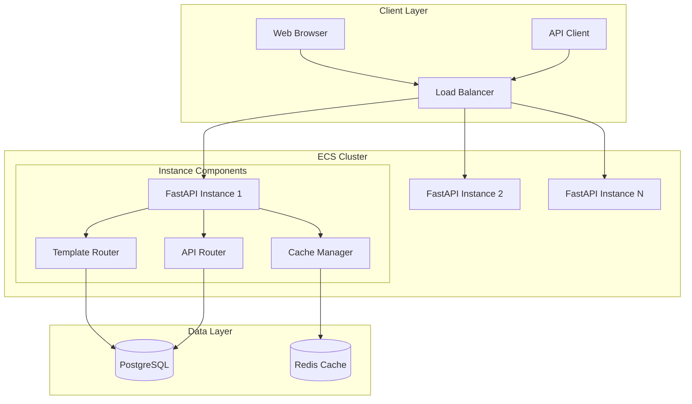
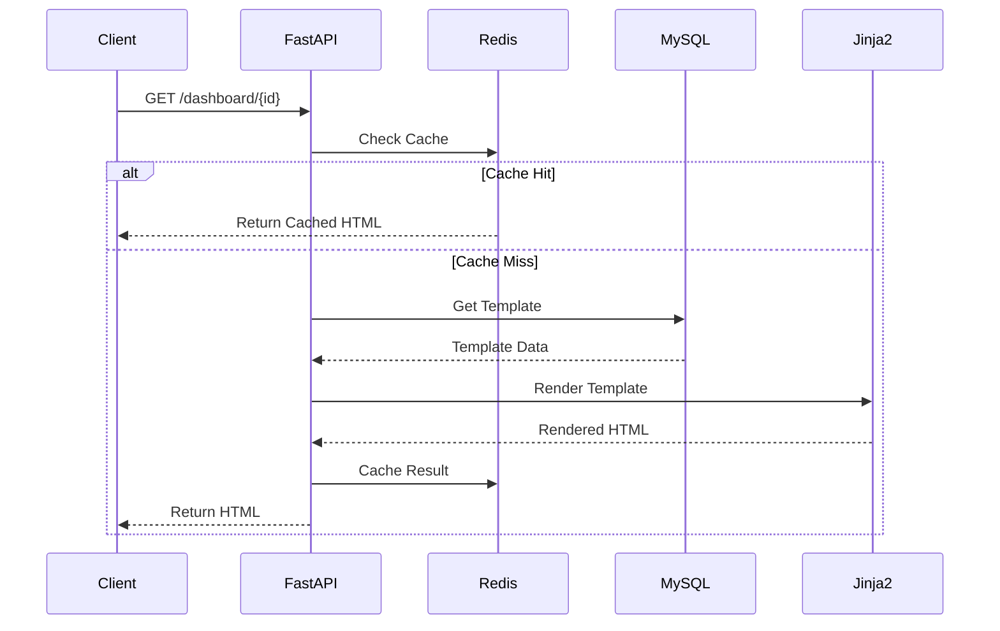

# AGI 솔루션 - 동적 대시보드 & API 서버 상세 기획서

## 1. 개요

### 1.1 목적
AGI 솔루션의 웹 인터페이스와 API 서비스를 통합 제공하는 시스템으로, DB 기반의 동적 템플릿 관리를 통해 ECS 환경에서 효율적인 멀티 인스턴스 운영을 지원합니다.

### 1.2 핵심 가치
- **유연성**: 코드 배포 없이 UI 업데이트 가능
- **확장성**: 멀티 인스턴스 환경 지원
- **효율성**: 캐싱을 통한 성능 최적화
- **통합성**: 단일 시스템에서 웹과 API 서비스 제공

## 2. 시스템 아키텍처

### 2.1 기술 스택
```yaml
Backend:
  - FastAPI
  - Jinja2
  - SQLAlchemy
  - Redis

Database:
  - PostgreSQL
  - Redis Cache

Infrastructure:
  - AWS ECS
  - AWS RDS
  - AWS ElastiCache
```

### 2.2 시스템 구조도



## 3. 핵심 컴포넌트

### 3.1 데이터베이스 스키마

```sql
-- 템플릿 테이블
CREATE TABLE templates (
    id SERIAL PRIMARY KEY,
    name VARCHAR(100) UNIQUE,
    description TEXT,
    html_content TEXT,
    css_content TEXT,
    js_content TEXT,
    config JSONB,
    is_active BOOLEAN DEFAULT true,
    created_at TIMESTAMP DEFAULT CURRENT_TIMESTAMP,
    updated_at TIMESTAMP DEFAULT CURRENT_TIMESTAMP
);

-- 라우트 테이블
CREATE TABLE routes (
    id SERIAL PRIMARY KEY,
    path VARCHAR(200) UNIQUE,
    template_id INTEGER REFERENCES templates(id),
    method VARCHAR(10) DEFAULT 'GET',
    handler_config JSONB,
    is_active BOOLEAN DEFAULT true,
    created_at TIMESTAMP DEFAULT CURRENT_TIMESTAMP
);
```

### 3.2 캐싱 전략

#### 템플릿 캐싱
```python
Cache Structure:
{
    "template:{id}": {
        "content": "rendered_html",
        "ttl": 300  # 5분
    }
}
```

#### API 응답 캐싱
```python
Cache Structure:
{
    "api:{endpoint}:{params_hash}": {
        "response": "serialized_response",
        "ttl": 300  # 5분
    }
}
```

## 4. API 명세

### 4.1 엔드포인트 구조
```
/api/v1/
├── templates/
│   ├── GET    /                 # 템플릿 목록
│   ├── POST   /                 # 템플릿 생성
│   ├── GET    /{id}            # 템플릿 조회
│   ├── PUT    /{id}            # 템플릿 수정
│   └── DELETE /{id}            # 템플릿 삭제
│
├── routes/
│   ├── GET    /                 # 라우트 목록
│   ├── POST   /                 # 라우트 생성
│   └── PUT    /{id}            # 라우트 수정
│
└── data/
    ├── GET    /dashboard/{id}   # 대시보드 데이터
    └── POST   /widget/{id}      # 위젯 데이터 업데이트
```

### 4.2 응답 형식
```json
{
    "status": "success|error",
    "data": {
        // Response data
    },
    "message": "Optional message",
    "timestamp": "2024-01-01T00:00:00Z"
}
```

## 5. 구현 세부사항

### 5.1 템플릿 렌더링 프로세스


### 5.2 보안 설정
```python
Security Layers:
1. API Key Authentication
2. CORS Protection
3. Rate Limiting
4. SQL Injection Prevention
5. XSS Protection
```

## 6. 모니터링 및 로깅

### 6.1 모니터링 메트릭스
```yaml
Performance:
  - Response Time
  - Request Rate
  - Error Rate
  - Cache Hit Rate

Resources:
  - CPU Usage
  - Memory Usage
  - DB Connections
  - Cache Memory Usage

Custom Metrics:
  - Template Render Time
  - API Response Time
  - Cache Efficiency
```

### 6.2 로그 구조
```json
{
    "timestamp": "ISO8601",
    "level": "INFO|WARNING|ERROR",
    "service": "template|api|cache",
    "instance_id": "ecs_instance_id",
    "event": "event_name",
    "details": {
        // Event specific details
    }
}
```

## 7. 성능 최적화 전략

### 7.1 렌더링 성능 개선
```yaml
# 서버 사이드 최적화
Template Optimization:
  - 템플릿 사전 컴파일
  - 부분 템플릿 캐싱
  - 중첩 템플릿 최소화

Component Lazy Loading:
  - 필요한 시점에 동적 로드
  - 컴포넌트 단위 캐싱
  - 우선순위 기반 로딩

Resource Management:
  - 정적 리소스 CDN 활용
  - 이미지 최적화
  - CSS/JS 번들링 및 압축
```

### 7.2 ECS 구성
```yaml
Task Definition:
  CPU: 1024
  Memory: 2048
  Containers:
    - FastAPI App:
        Memory: 1024
        Port: 8000
    - Redis:
        Memory: 512
        Port: 6379

Service:
  Desired Count: 2
  Min Count: 1
  Max Count: 5
  Auto Scaling:
    CPU Threshold: 70%
    Memory Threshold: 80%
```

### 7.3 성능 모니터링
```python
Performance Metrics:
  Template Rendering:
    - 렌더링 시간
    - 메모리 사용량
    - 캐시 히트율
  
  API Response:
    - 응답 시간
    - 처리량
    - 오류율

  Resource Usage:
    - CPU 사용률
    - 메모리 사용률
    - 네트워크 대역폭
```

## 8. 개발 로드맵

### Phase 1: 기반 구축 (2주)
- [x] 데이터베이스 스키마 설계
- [x] FastAPI 앱 기본 구조
- [x] 템플릿 시스템 구현
- [ ] 캐싱 시스템 구현

### Phase 2: 성능 최적화 (2주)
- [ ] 템플릿 렌더링 최적화
- [ ] 캐싱 전략 구현
- [ ] 리소스 관리 시스템
- [ ] 성능 테스트 및 개선

### Phase 3: 모니터링 및 안정화 (1주)
- [ ] 모니터링 시스템 구축
- [ ] 성능 메트릭 수집
- [ ] 장애 대응 시스템
- [ ] 운영 문서 작성

## 9. 결론

이 시스템은 DB 기반의 동적 템플릿 관리를 통해 유연한 웹 서비스를 제공합니다. 다만 동적 렌더링의 특성상 성능 이슈가 발생할 수 있으므로, 철저한 캐싱 전략과 성능 최적화가 필수적입니다. 특히 다음 사항들을 중점적으로 고려해야 합니다:

1. 템플릿 사전 컴파일 및 캐싱
2. 컴포넌트 단위의 최적화
3. 리소스 관리 및 CDN 활용
4. 실시간 성능 모니터링

이러한 전략을 통해 동적 템플릿의 유연성을 유지하면서도 acceptable한 수준의 성능을 제공할 수 있습니다.