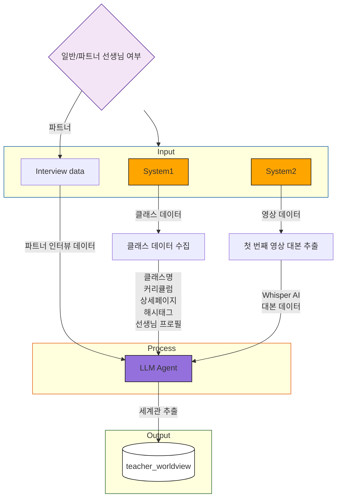

## input 값 정리
1. LLM input_data
    - 시스템1이 수집한 클래스 txt 데이터
    - 시스템2가 수집한 첫 번째 영상 대본
    - (파트너의 경우) 파트너 인터뷰 데이터 -> 삽입 공간 필요.

## 업데이트 이벤트 (트리거)
- 시스템2에서 뱉는 첫 번째 영상 대본이 update 될 경우, 에이전트 실행
    - 영상이 변경되는 순간이 트리거.